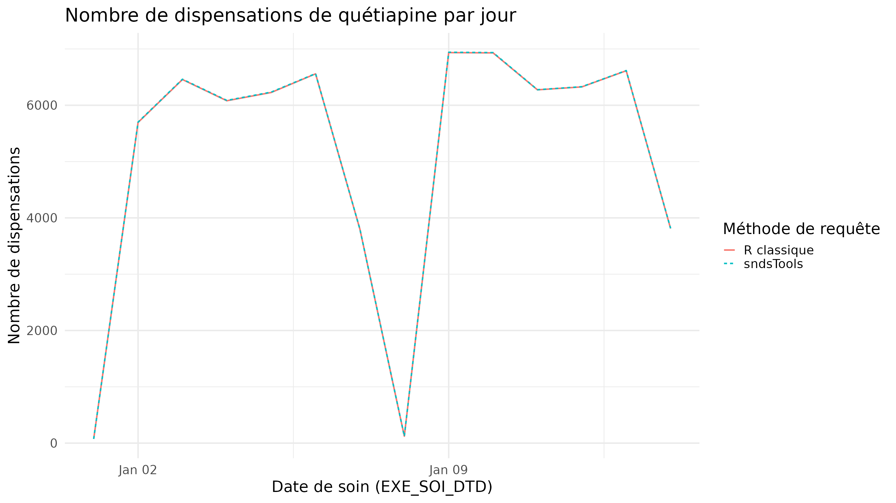

# Comparaison sndsTools vs R classique

## Paramètres de la comparaison

``` r
library(dplyr)
library(lubridate)

atc_quetiapine = "N05AH04"

date_deb = "2023-01-01"
date_fin = "2023-01-14"
```

## La requête

- `sndsTools`
- R classique

On appelle la fonction
[`extract_drug_dispenses()`](../reference/extract_drug_dispenses.md) en
indiquant la date de début de la période d’intérêt, la date de fin, et
l’ATC qui nous intéresse.

``` r
source(here::here("sndsTools.R"))
conn <- connect_oracle()

t0 = Sys.time()
output_quetiapine_sndstools <- extract_drug_dispenses(
  start_date = as.Date(date_deb),
  end_date = as.Date(date_fin),
  atc_cod_starts_with_filter = atc_quetiapine,
  dis_dtd_lag_months = 6, # pour requêter les liquidations arrivant après la date de soin.
  conn = conn
)

timed_sndsTool = difftime(Sys.time(), t0, units = "secs")
print(paste(
  "Temps de calcul - sndsTools : ", round(timed_sndsTool), "secondes" # 162s
))
```

On filtre `ER_PRS_F` sur les dates choisies ainsi que les filtres
habituels, puis on fait une jointure avec `ER_PHA_F` filtrée sur les CIP
de quétiapine récupérés dans `IR_PHA_R`.

``` r
library(ROracle)
drv <- dbDriver("Oracle")
conn <- dbConnect(drv, dbname = "IPIAMPR2.WORLD")
Sys.setenv(TZ = "Europe/Paris")
Sys.setenv(ORA_SDTZ = "Europe/Paris")
# Pour requêter les liquidations arrivant après la date de soin.
date_fin_6m <- "2023-08-01"

dcir_join_keys <- c(
  "DCT_ORD_NUM",
  "FLX_DIS_DTD",
  "FLX_EMT_ORD",
  "FLX_EMT_NUM",
  "FLX_EMT_TYP",
  "FLX_TRT_DTD",
  "ORG_CLE_NUM",
  "PRS_ORD_NUM",
  "REM_TYP_AFF"
)

erprsf <- tbl(conn, "ER_PRS_F") |>
  filter(
    FLX_DIS_DTD >= to_date(date_deb, "YYYY-MM-DD") &
      FLX_DIS_DTD < to_date(date_fin_6m, "YYYY-MM-DD") &
      EXE_SOI_DTD >= to_date(date_deb, "YYYY-MM-DD") &
      EXE_SOI_DTD <= to_date(date_fin, "YYYY-MM-DD") &
      DPN_QLF != 71 &
      CPL_MAJ_TOP < 2
  ) |>
  select(c(dcir_join_keys, "EXE_SOI_DTD", "BEN_NIR_PSA", "PSP_SPE_COD"))

irphar_quetiapine <- tbl(conn, "IR_PHA_R") |>
  filter(PHA_ATC_CLA == atc_quetiapine) |>
  select(PHA_ATC_CLA, PHA_CIP_C13) |>
  distinct()

erphaf <- tbl(conn, "ER_PHA_F") |>
  select(c(dcir_join_keys, "PHA_PRS_C13", "PHA_ACT_QSN")) |>
  inner_join(irphar_quetiapine, by = c("PHA_PRS_C13" = "PHA_CIP_C13"))


er_ete_f <- tbl(conn, "ER_ETE_F") |>
  select(c(dcir_join_keys, "ETE_IND_TAA"))

output_quetiapine_classique <- erprsf |>
  inner_join(erphaf) |>
  left_join(er_ete_f) |>
  filter(ETE_IND_TAA != 1 | is.na(ETE_IND_TAA))

t0 <- Sys.time()
output_quetiapine_classique <- output_quetiapine_classique |>
  collect() |>
  select(
    BEN_NIR_PSA,
    EXE_SOI_DTD,
    PHA_ACT_QSN,
    PHA_ATC_CLA,
    PHA_PRS_C13,
    PSP_SPE_COD
  ) |>
  distinct()

timed_classique <- difftime(Sys.time(), t0, units = "secs")
print(paste(
  "Temps de calcul - méthode classique : ", round(timed_classique), "secondes" # 39s
))
```

La requête sndsTools est plus lente que la requête classique, car elle
effectue des requêtes pour chaque mois de flux demandé, comme le
recommande [les bonnes pratiques du portail de la
CNAM](https://documentation-snds.health-data-hub.fr/snds/cnam/bonnes_pratiques_r/guide_de_bonnes_pratiques/magic_loop_sur_r.html).

## Les résultats

En modifiant la colonne `EXE_SOI_DTD` pour ne récupérer que le jour de
l’événement, on vérifie que chaque ligne de la sortie classique est dans
la sortie de sndsTools et vice versa.

``` r
# Comparaison ligne à ligne
line_by_line_differences <- output_quetiapine_classique |>
  mutate(EXE_SOI_DTD = as_date(EXE_SOI_DTD)) |>
  anti_join(
    output_quetiapine_sndstools |>
      mutate(EXE_SOI_DTD = as_date(EXE_SOI_DTD))
  ) |>
  tally() # Si les deux méthodes sont identiques, ce résultat devrait être 0
print(paste("Nombre de lignes différentes entre les deux méthodes : ", line_by_line_differences)) # 0

plot_data <- rbind(
    output_quetiapine_sndstools |>
    group_by(EXE_SOI_DTD) |>
    tally() |> mutate(requete="sndsTools"),
    output_quetiapine_classique |>
    group_by(EXE_SOI_DTD) |>
    tally() |> mutate(requete="R classique")
)
write.csv(
  plot_data, here::here("inst/extdata/benchmark_sndstools_vs_r.csv"),
row.names = FALSE
)
```

``` r
library(ggplot2)
plot_data <- read.csv(here::here("inst/extdata/benchmark_sndstools_vs_r.csv"))
# Graphique
ggplot(
  data = plot_data,
  aes(
    x = lubridate::as_date(EXE_SOI_DTD), y = n,
    color = requete, linetype = requete
    )
) +
  geom_line()+
  theme_minimal(base_size = 20) +
  labs(
    title = "Nombre de dispensations de quétiapine par jour",
    x = "Date de soin (EXE_SOI_DTD)",
    y = "Nombre de dispensations",
    color = "Méthode de requête",
    linetype = "Méthode de requête"
  )
```


